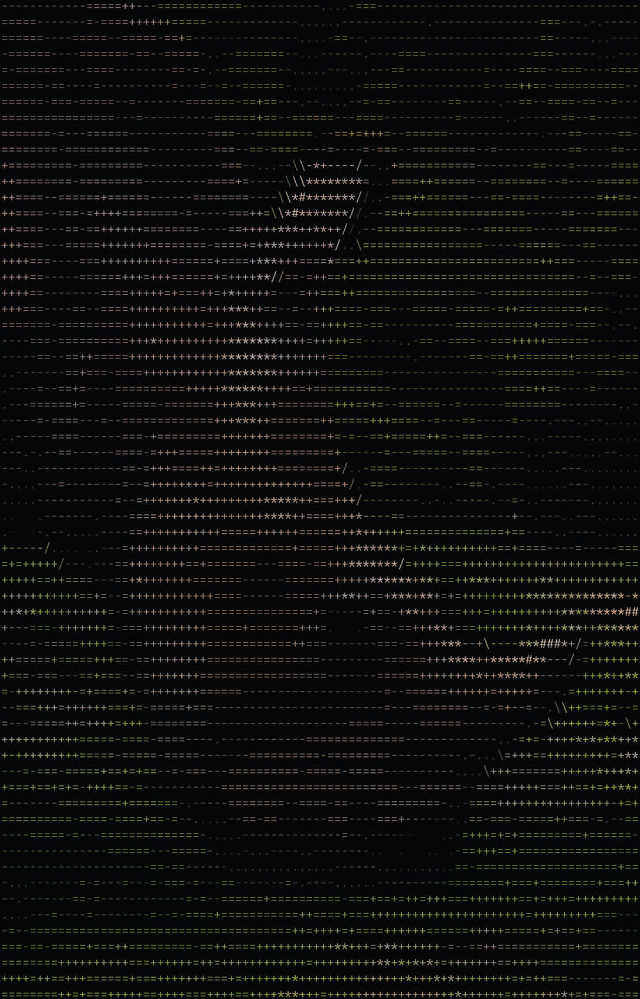

# print
Prints out an image to the terminal.

Features:
- Specifiable ascii ramp: The program maps pixel brightness to
a range of ascii-characters, and the ramp's brightness progression can
be specified by the user.
- Color: The image gets cut into smaller rectangles, and in each rectangle the
program averages the color of the inner pixels, which then contribute to the
overall colour of the ascii-character meant to describe that region.
- Edge detection: To make edges easier to see edges get highlighted with
ascii-characters such as `/`, `|`, `\` and `-`. This is achieved through
the [Sobel operator](https://en.wikipedia.org/wiki/Sobel_operator).

---
### Example Output
Below is a side-by-side comparison of the original image and the program's rendered output.

| Input (JPEG 2343×3514) | Output (JPEG 1084×1692) |
| --- | --- |
|  |  |

---
### Quick Start
If the program has been compiled (see Build for more details), then run
this command to quickly get an image:
```bash
zig-out/bin/print --path=path/to/image
```

---

### Build
In the project's directory, simply run
```bash
zig build
```
which will build the program. The executable is found in `zig-out/bin/print`.

For further instructions, run
```bash
zig-out/bin/print --help
```

---

### Dependencies
If you are a Nix user, then enter the devShell via:
```bash
nix develop
```

Otherwise, install the Zig compiler via your machine's package manager.
